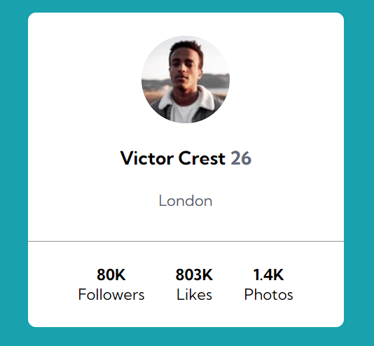

<h1 style="text-align: center;">Projeto Card Component</h1>
    

  

## Sobre
- Um exercício simples feito para praticar minhas habilidades sobre a propriedade flex.

## Tecnologias Utilizadas 
- HTML 
- CSS

## Responsividade
- Para todos os tipos de dispositivos.

Projeto criardo e disponibilizado através do curso <a style="text-decoration: underline; color: white;" target="_blank" href="https://www.instagram.com/devemdobro/">Dev em dobro</a>.
